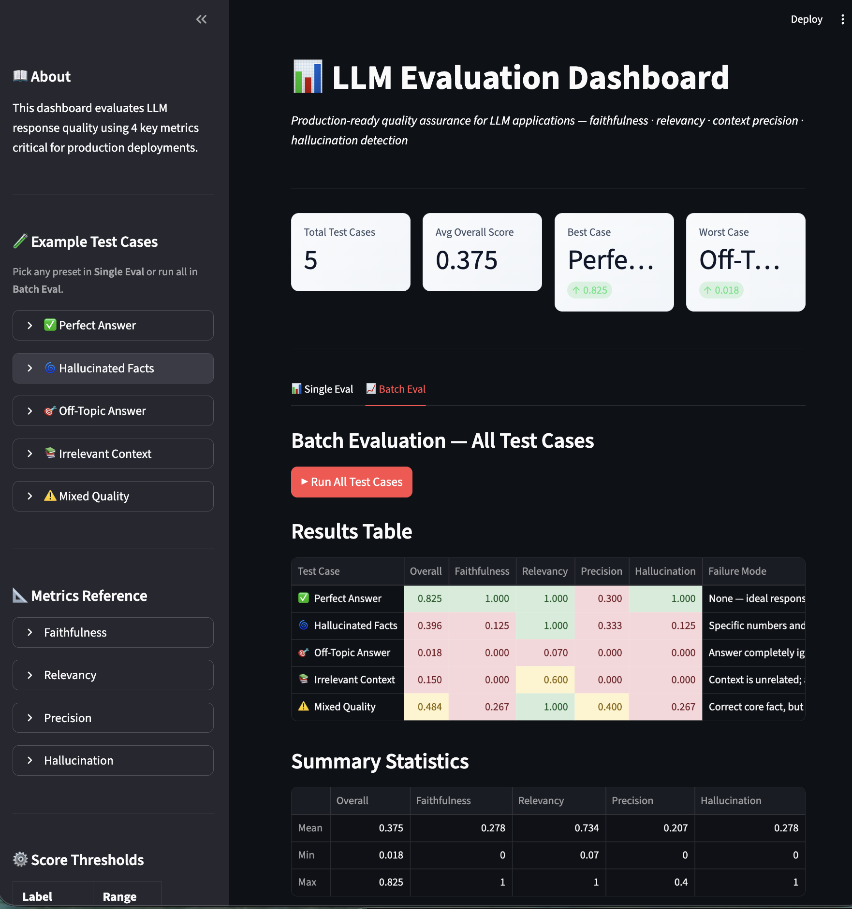

<div align="center">

# 📊 measure

### Production LLM Evaluation Dashboard

**"My LLM works great" isn't a metric. These are.**

[](https://streamlit.io/)
[](https://plotly.com/)
[](LICENSE)



</div>

---

## ⚠️ The Problem

Production LLMs fail silently:

- Hallucinate facts **with confidence**
- Answer off-topic questions without noticing
- Ignore retrieved context entirely
- Give verbose answers when precision matters

**You need metrics, not vibes.**

## ✨ The Solution

`measure` scores LLM outputs on 4 dimensions that matter in production:

📏 **Faithfulness** — Is the answer grounded in context?  
🎯 **Relevancy** — Does it actually answer the question?  
✂️ **Precision** — Focused or verbose?  
🚨 **Hallucination** — Any made-up facts?

## 🚀 Quick Start

```bash
pip install -r requirements.txt
streamlit run app.py
```

No API keys needed. All metrics run locally.

## 📈 Example Results

| Test Case | Overall | Faithfulness | Relevancy | Precision | Hallucination |
|-----------|---------|-------------|-----------|-----------|---------------|
| ✅ Perfect Answer | 0.825 | 1.000 | 1.00 | 0.300 | 1.000 |
| 🌀 Hallucinated Facts | 0.396 | 0.125 | 1.00 | 0.333 | 0.125 |
| 🎯 Off-Topic Answer | 0.018 | 0.000 | 0.07 | 0.000 | 0.000 |
| ⚠️ Mixed Quality | 0.484 | 0.267 | 1.00 | 0.400 | 0.267 |

## 🎯 Metrics Explained

### 📏 Faithfulness (Grounding)
```
Score = (Answer words ∩ Context words) / Answer words
Good: > 0.7
```
Measures if the answer is grounded in the provided context.

### 🎯 Relevancy (Question Alignment)
```
Score = (Question keywords ∩ Answer keywords) / Question keywords
Good: > 0.8
```
Measures if the answer actually addresses the question asked.

### ✂️ Precision (Conciseness)
```
Score = (Context words used) / (Total context words)
Good: > 0.5
```
Measures if the answer is focused, not verbose.

### 🚨 Hallucination (Factuality)
```
Score = 1 - (Answer words ∉ Context) / Total answer words
Good: > 0.9
```
Measures if the answer introduces facts not in the source context.

## 🏗️ How It Works

```
Question + Context + Answer
    ↓
4 Metric Calculators (keyword-based heuristics)
    ├─ Faithfulness   → word overlap analysis
    ├─ Relevancy      → keyword matching
    ├─ Precision      → context usage ratio
    └─ Hallucination  → novel word detection
    ↓
Overall Score (weighted average)
    ↓
Plotly Visualizations (radar chart + heatmap)
```

## 💡 Use Cases

✅ **Batch Evaluation** — Test 5 scenarios, find failure modes at a glance  
✅ **A/B Testing** — Compare prompt variations with objective scores  
✅ **Regression Testing** — Ensure model updates don't degrade quality  
✅ **Production Monitoring** — Track metric trends over time

## 📦 Tech Stack

`Streamlit` • `Plotly` • `Pandas` • `Python`

## 🔧 Configuration

No API keys needed. All metrics run locally using keyword heuristics.

## 📄 License

MIT © 2026 MD Rahinul Islam Bhuiyan

---

<div align="center">

Built with 📏 by [@cyberjaya101](https://github.com/cyberjaya101)

[Report Bug](https://github.com/cyberjaya101/measure/issues) • [Request Feature](https://github.com/cyberjaya101/measure/issues)

</div>
